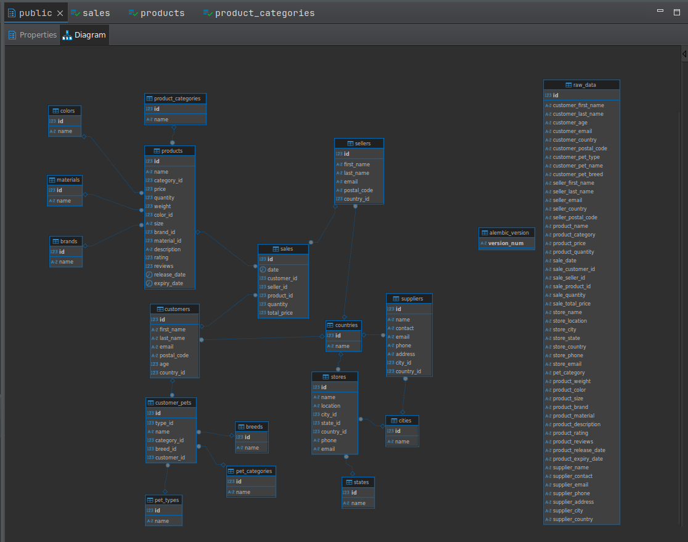

# Описание решенияа

Начал я с того, что создал docker-контейнер для БД postgres. Дальше подключил alembic и sqlalchemy. Дальше сделал таблицу для сырых данных и написал скрипт dataLoader.py для экспорта данных из .csv файлов в БД. После этого я внимательно посмотрел на имена колонок и понял, что это просто таблица в денормализованной форме. Собственно, в процессе нормализации я получил структуру "снежинки", как показано на каринке ниже:

Как оказалось, таблица sales(продажи) и есть таблица фактов, остальное -- таблицы измерений

Для распила исходных данных по таблицам я использовал следующий метод: сначала добавим все перечислимые типы(типы продуктов, питомцев и т.д.), а потом уже всё остальное.
Реализован данный скрипт в файле splitRawDataToFacts.py. На обработку 10000 записей ушло порядка 10 минут. Не знаю -- много это или мало, т.к. не с чем сравнивать.

После небольшой аналитики(analytics.py) я выяснил, что каждая строка относится к своему уникальному покупателю, продавцу, и продукту, поэтому проверок на повторное добавление не было.

